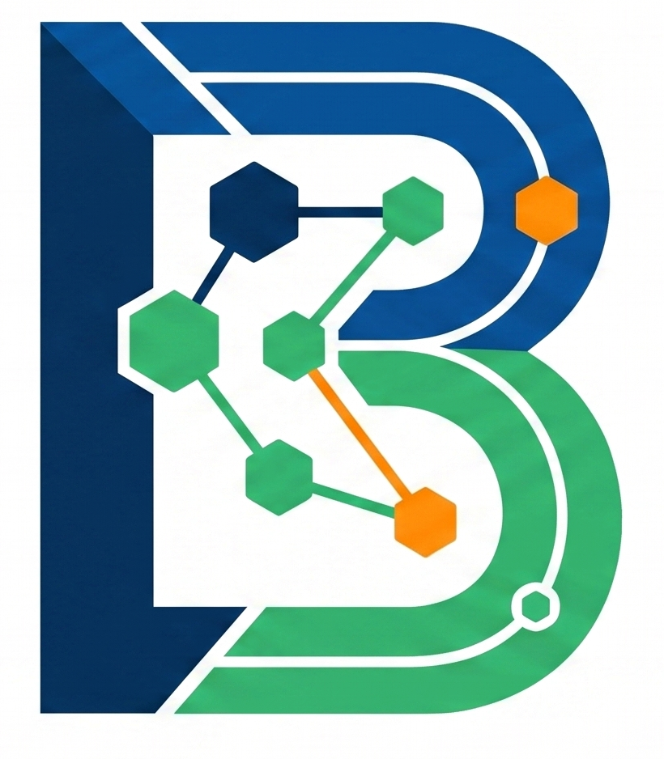

::: {style="text-align: justify;padding-right: 3em;"}
**Hello World, my name is Stefanos and welcome to my personal website!**

I am a Bioinformatician and Data Analyst (Ph.D., Double MSc) with a decade of experience driving data-driven biological research. Spanning 6 major research grants, my expertise encompasses skeletal biology, fish morphology, genomics, systems biology, and environmental data integration. Currently serving as a Science Officer and Panel Coordinator at HFRI, I manage high-level research evaluation frameworks. Backed by certifications in Project Management and Data Science (R & Python), my technical work has resulted in 12 peer-reviewed publications and 11 conference proceedings.

### What I am looking for

I am actively seeking remote Bioinformatics or Data Science roles within the EMEA region. I thrive in highly technical environments and am looking for an opportunity to spend 80% of my time focused on coding, data analysis, and pipeline architecture to push boundaries in the biotech, conservation, and environmental industries.

### Beyond the Code

Outside the lab and away from the keyboard, you will usually find me outdoors hiking, training in martial arts (BJJ, Kyokushin Karate, Kickboxing), or proudly serving as a volunteer Samaritan cadet with the Hellenic Red Cross.

From research and collaborations to conferences and hobbies, you’ll find a bit of everything here. 

Have a look around and feel free to reach out if you’d like to connect!

{fig-align="center" width="25%"}

:::

